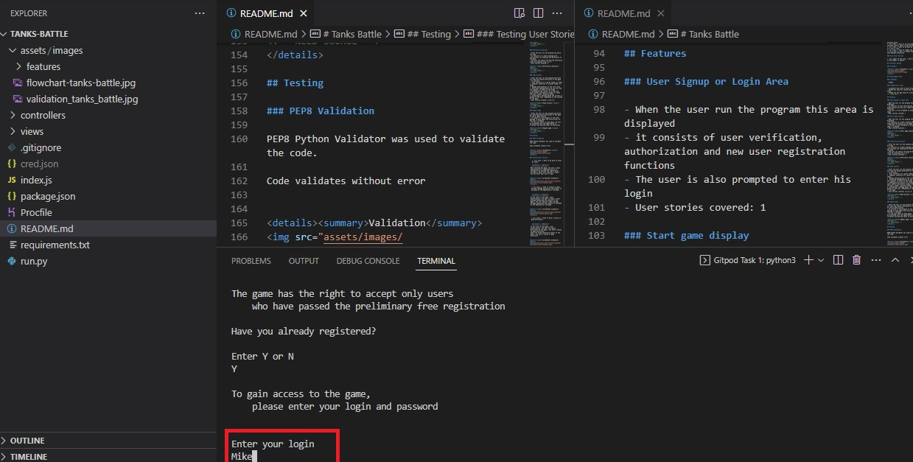
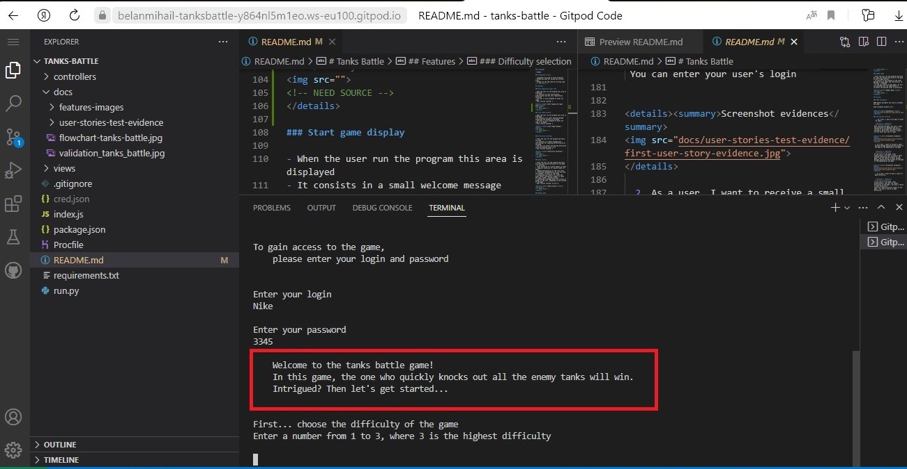
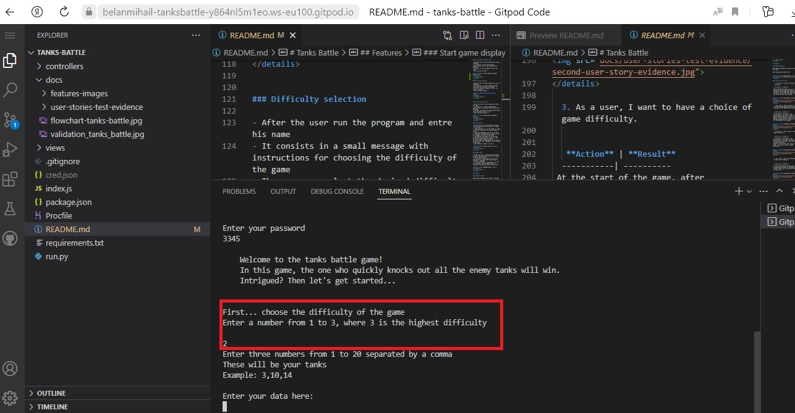

# Tanks Battle
(Developer: Bilan Mykhailo)

A simple logic game similar to a sea battle. In this game, the player will have to fight against the computer in a tank duel. Victory in the game is awarded if all enemy tanks are knocked out

## Table of Content

1. [Project Goals](#project-goals)
    1. [User Goals](#user-goals)
    2. [Site Owner Goals](#site-owner-goals)

## Project Goals

### User Goals

 - Play an interesting game similar to sea battle
 - Have the ability to choose the difficulty of the game.
 - Be able to start a new game after the end of the game with a choice of difficulty level

### Site Owner Goals

  - Create a game similar to sea battle which is easy and clear to user

## User Experience

### Target Audience

- People of different ages who want to play a logic game similar to a sea battle.

### User Requrements and Expectations

- Simple and user-friendly to use;
- Interactive interaction with the user (reaction to user actions)

### User Stories 

1. As a user, I want to be able to enter my login.
2. As a user, I want to receive a small welcome message explaining the essence of the game at the beginning of the game.
3. As a user, I want to have a choice of game difficulty.
4. As a user, I want to be notified that my shot hit the target 
5. As a user, I want to be notified that computers shot hit the target
6. As a user, I want to be notified of possible moves
7. As a user, I want to be notified how many and what kind of tanks I have during the game
8. As a user, I want to be able be notified if i win or lose.
9. As a user, I want to repeat the qame
10. As a user, I want to repeat the qame with another difficulty

### Site Owner Stories

1. As a owner of the site, i want increase in the number of guests;

## Technical Design

### Flowchart

Flowchart

<!-- NEED SOURCE -->

## Technologies Used

### Languages

- Python

### Frameworks & Tools

- Lucidchart was used to build flowchart.
- GitHub was used for saving and storing files.
- GitPod was the IDE used for writing code. 
<!-- MORE INFO -->

## Features

### Start page display

- When the user run the program this area is displayed
- It consists in a small welcome message explaining the essence of the game
- The user is also prompted to enter his name or nickname
- User stories covered: 1, 2

Start page display

<!-- NEED SOURCE -->

### User Signup or Login Area
<!-- NEED -->

User Signup or Login Area

<!-- NEED SOURCE -->

### Difficulty selection

- After the user run the program and entre his name
- It consists in a small message with instructions for choosing the difficulty of the game
- The user can select the desired difficulty level by pressing from 1 to 3
- User stories covered: 3

Difficulty selection

<!-- NEED SOURCE -->

### Game process

- After the user run the program and entre his name and choose difficulty of the game
- It consists:
1. User selection of a given number of tanks
2. Computer selection of a given number of tanks
3. Random determination of the first move
4. Alternate implementation by the user and the computer of shots at the enemy
5. Displaying the results of a shot and other useful information (number of tanks and their number, possible moves)
6. Displaying a message about the victory or defeat of the user, depending on the outcome of the game
- User stories covered: 4,5,6,7,8

Game process

<!-- NEED SOURCE -->

### Repeat game

- After the user run the program and entre his name and choose difficulty of the game at end of game process
- It consist in the display of the offer message to play again and instructions on the user's response
- If the user wants to play again, he will be presented with the opportunity to re-select the desired level of difficulty 

Repeat game

<!-- NEED SOURCE -->

## Testing

### Validation

PEP8 Python Validator was used to validate the code.

Code validates without error

Validation

<!-- INFO -->

### Testing User Stories

   1. As a user, I want to be able to enter my login.

   **Action** | **Result** 
  -----------| ----------  
 When starting the game, the user's login and password are requested and he is offered to go through the registration procedure, which also requires a login | You can enter your user's login  

Screenshot evidences

 

  2. As a user, I want to receive a small welcome message explaining the essence of the game at the beginning of the game.

   **Action** | **Result** 
  -----------| ----------  
 At the start of the game, after authorization, the user is shown a short message explaining the essence of the game | You can receive a small welcome message explaining the essence of the game at the beginning of the game  

Screenshot evidences

 

  3. As a user, I want to have a choice of game difficulty.

   **Action** | **Result** 
  -----------| ----------  
 At the start of the game, after authorization, the user can choose difficulty of the game | You have a choice of game difficulty. 
 There are three difficulty levels of the game | You have a choice of game difficulty.  

Screenshot evidences

 

<!-- 2. As a user, I want to receive a small welcome message explaining the essence of the game at the beginning of the game.
3. As a user, I want to have a choice of game difficulty.
4. As a user, I want to be notified that my shot hit the target 
5. As a user, I want to be notified that computers shot hit the target
6. As a user, I want to be notified of possible moves
7. As a user, I want to be notified how many and what kind of tanks I have during the game
8. As a user, I want to be able be notified if i win or lose.
9. As a user, I want to repeat the qame
10. As a user, I want to repeat the qame with another difficulty --> -->

## Bugs

<!-- - The site logo was designed as a simple link and was not a first level heading, which is why the site did not have a first level heading

    **Actions**: add a first level heading to the logo link;

    **Result**: the site logo also became the first level heading and the first level heading appeared on the site;

    **Status**: bug fixed; -->