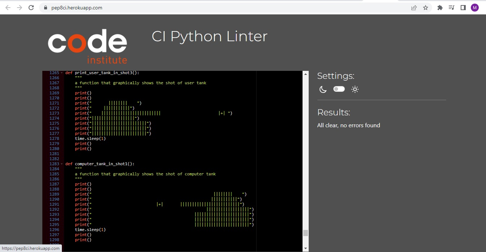

# Tanks Battle
(Developer: Bilan Mykhailo)

[Live webpage](https://tanks-battle.onrender.com/)

A simple logic game similar to a sea battle. In this game, the player will have to fight against the computer in a tank duel. Victory in the game is awarded if all enemy tanks are knocked out

## Table of Content

1. [Project Goals](#project-goals)
    1. [User Goals](#user-goals)
    2. [Site Owner Goals](#site-owner-goals)
2. [User Experience](#user-experience)
    1. [Target Audience](#target-audience)
    2. [User Requirements and Expectations](#user-requirements-and-expectations)
    3. [User Stories](#user-stories)
    4. [Site Owner Stories](#site-owner-stories)
3. [Technical Design](#technical-design)
    1. [Flowchart](#flowchart)
4. [Technologies Used](#technologies-used)
    1. [Languages](#languages)
    2. [Frameworks & Tools](#frameworks-&-tools)
5. [Features](#features)
    1. [Tank Image](#tank-image)
    2. [User Signup and Login Area](#user-signup-and-login-area)
    3. [Start game display](#start-game-display)
    4. [Difficulty selection](#difficulty-selection)
    5. [Game process](#game-process)
    6. [Repeat game](#repeat-game)
6. [Testing](#testing)
    1. [PEP8 Validation](#pep8-validation)
    2. [Testing User Stories](#testing-user-stories)
7. [Bugs](#bugs)
8. [Deployment](#deployment)
9. [Credits](#credits)
    1. [Content](#content)
    2. [Code](#code)
10. [Acknowledgements](#acknowledgements)

## Project Goals

### User Goals

 - Play an interesting game similar to sea battle
 - Have the ability to choose the difficulty of the game.
 - Be able to start a new game after the end of the game with a choice of difficulty level

### Site Owner Goals

  - Create a game similar to sea battle which is easy and clear to user

## User Experience

### Target Audience

- People of different ages who want to play a logic game similar to a sea battle.

### User Requrements and Expectations

- Simple and user-friendly to use;
- Interactive interaction with the user (reaction to user actions)

### User Stories 

1. As a user, I want to be able to enter my login.
2. As a user, I want to receive a small welcome message explaining the essence of the game at the beginning of the game.
3. As a user, I want to have a choice of game difficulty.
4. As a user, I want to be notified that my shot hit the target 
5. As a user, I want to be notified that computers shot hit the target
6. As a user, I want to be notified of possible moves
7. As a user, I want to be notified how many and what kind of tanks I have during the game
8. As a user, I want to be able be notified if i win or lose.
9. As a user, I want to repeat the qame
10. As a user, I want to repeat the qame with another difficulty

### Site Owner Stories

1. As a owner of the site, i want increase in the number of guests;

## Technical Design

### Flowchart

Flowchart

## Technologies Used

### Languages

- Python

### Frameworks & Tools

- Lucidchart was used to build flowchart.
- GitHub was used for saving and storing files.
- GitPod was the IDE used for writing code. 
- Render was used to deployment project

## Features

### Tank Image
- When the user run the program this area is displayed
- it consists of the image of the tank which is the symbol of the game

Tank Image

### User Signup and Login Area

- After start image
- it consists of user verification, authorization and new user registration functions
- The user is also prompted to enter his login
- User stories covered: 1

User Signup and Login Area

### Start game display

- After the user run the program and sing up
- It consists in "welcome" image a small welcome message explaining the essence of the game
- The user is also prompted to enter his name or nickname
- User stories covered: 2

Start page display

### Difficulty selection

- After the user run the program, sign up and welcome message
- It consists in a small message with instructions for choosing the difficulty of the game
- The user can select the desired difficulty level by pressing from 1 to 3
- User stories covered: 3

Difficulty selection

### Game process

- After the user run the program and entre his name and choose difficulty of the game
- It consists:
1. User selection of a given number of tanks
2. Computer selection of a given number of tanks
3. Random determination of the first move
4. Alternate implementation by the user and the computer of shots at the enemy
5. Displaying the results of a shot and other useful information (number of tanks and their number, possible moves)
6. Displaying a message about the victory or defeat of the user, depending on the outcome of the game
- User stories covered: 4,5,6,7,8

Game process

### Repeat game

- After the user run the program and entre his name and choose difficulty of the game at end of game process
- It consist in the display of the offer message to play again and instructions on the user's response
- If the user wants to play again, he will be presented with the opportunity to re-select the desired level of difficulty 
- User stories covered: 9,10

Repeat game

## Testing

### PEP8 Validation

PEP8 Python Validator was used to validate the code.

Code validates without error

Validation

### Testing User Stories

   1. As a user, I want to be able to enter my login.

   **Action** | **Result** 
  -----------| ----------  
 When starting the game, the user's login and password are requested and he is offered to go through the registration procedure, which also requires a login | You can enter your user's login  

Screenshot evidences

 

  2. As a user, I want to receive a small welcome message explaining the essence of the game at the beginning of the game.

   **Action** | **Result** 
  -----------| ----------  
 At the start of the game, after authorization, the user is shown a short message explaining the essence of the game | You can receive a small welcome message explaining the essence of the game at the beginning of the game  

Screenshot evidences

 

  3. As a user, I want to have a choice of game difficulty.

   **Action** | **Result** 
  -----------| ----------  
 At the start of the game, after authorization, the user can choose difficulty of the game | You have a choice of game difficulty. 
 There are three difficulty levels of the game | You have a choice of game difficulty.  

Screenshot evidences

 

  4. As a user, I want to be notified that my shot hit the target.

   **Action** | **Result** 
  -----------| ----------  
 In case of hitting an enemy tank, a corresponding message is displayed on the screen | User will be notified when it hits an enemy tank. 
  

Screenshot evidences

 

  5. As a user, I want to be notified that computers shot hit the target.

   **Action** | **Result** 
  -----------| ----------  
 If the computer enters the player's tank, a corresponding notification will be displayed on the screen | User will be notified when computers shot hits the target. 
  

Screenshot evidences

 

  6. As a user, I want to be notified of possible moves.

   **Action** | **Result** 
  -----------| ----------  
 Each time before the player's move, a notification is displayed on the screen with a list of possible moves updated during the game | User will be notified of possible moves. 
  

Screenshot evidences

 

  7. As a user, I want to be notified how many and what kind of tanks I have during the game

   **Action** | **Result** 
  -----------| ----------  
 Each time before the player's move, a notification is displayed on the screen with a information of how many and what kind of tanks has user | User will be notified how many and what kind of tanks he has during the game. 
  

Screenshot evidences

 

  8. As a user, I want to be able be notified if i win or lose.

   **Action** | **Result** 
  -----------| ----------  
 When the player or the computer has no tanks left, a corresponding message is displayed on the screen | User will be notified if he win or lose. 
  

Screenshot evidences

 

 9. As a user, I want to repeat the qame.

   **Action** | **Result** 
  -----------| ----------  
 After the end of the game, regardless of its outcome, the player is invited to re-play the game | User can repeat the qame. 
  

Screenshot evidences

 

10. As a user, I want to repeat the qame with another difficulty.

   **Action** | **Result** 
  -----------| ----------  
 After restarting the game, the player is prompted to choose one of three possible options for the difficulty levels of the game. | User can repeat the qame with another difficulty. 
  

Screenshot evidences

 

## Bugs

- When restarting the game, the previously selected game difficulty is saved

    **Actions**: the restart function was moved from the game_cycle function block and called in the main function block. Added pick_user_level_game attribute to main function;

    **Result**: After restarting the game, it was possible to re-select the difficulty level;

    **Status**: bug fixed;

- The function used to determine the tanks of the computer in the easy difficulty level did not work in the medium and hard difficulty, where it was required to select not just one, but several tanks

    **Actions**: A loop was added with the required number of iterations to iterate through the values of the list of possible tanks and randomize the added value.;

    **Result**: The function began to work correctly on medium and hard difficulty;

    **Status**: bug fixed;

- When checking the user's shot, there was no check for the repetition of the entered value

    **Actions**: A conditional expression if in was added to the try block of the validate_user_shot function to exclude a detected error;

    **Result**: When entering a repeated shot value, the user began to receive an error notification;

    **Status**: bug fixed;

- The list of possible computer moves was not suitable for randomizing the computer's actions.

    **Actions**: The list of possible computer moves has been looped through with the shuffle function. The resulting values have been added to the computer's list of random moves;

    **Result**: The resulting list became suitable for randomizing computer moves;

    **Status**: bug fixed;

## Deployment

<!-- NEED INFO -->

**How to clone the website:**
1. On GitHub.com, navigate to the main page of the repository.
2. click "Code" button.
3. Select HTTPS, SSH, or Github CLI.
4. Open Git Bash
5. Change the current working directory to the one where you want the cloned directory
6. Type git clone and paste the URL from the clipboard ($ git clone https://github.com/YOUR-USERNAME/YOUR-REPOSITORY) 
7. Press Enter to create your local clone. 

**How to fork the website:**
1. Go to the GitHub repository
2. Click on Fork button

## Credits

### Content 

**Text content** are owned by the developer.

Idea of  game has been taken from sea battle game 

### Code

The following code idea was taken from Love Sandwiches Project:

 - Validate_user_details
 - How to import gspread
-  How to import Credentials from google.oauth

## Acknowledgements

I would like to express my sincere gratitude:

  - My mentor Mo Shami for his advice and support.
  - My daughter Alisa and my wife Snizhana for always giving me inspiration and strength to go forward.
  - The government of the city of Hamburg and the employees of the job center Mitti for my opportunity to study at these courses.
  - To all people who are in solidarity and support Ukraine